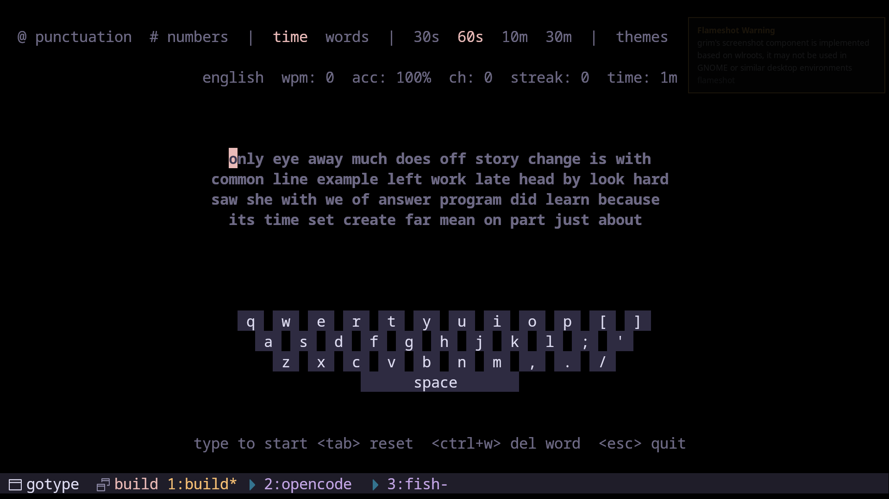

# gotype

Fast, responsive terminal typing practice built with Go and tcell.



## Features
- Time and word modes
- Toggle punctuation and numbers
- Theme switching
- Per-key error highlights
- Persistent preferences and best scores

## Install

Requires Go 1.24.6 or newer.

```bash
go install github.com/yossefsabry/gotype@latest
```

Make sure `$GOPATH/bin` (or `$HOME/go/bin`) is in your `PATH`, then run:

```bash
gotype
```

## Usage

- Type to start
- `Tab` to reset
- `Ctrl+W` to delete the previous word
- `Esc` to quit

Use the top bar to toggle punctuation, numbers, mode, and theme.

## Build From Source

```bash
git clone https://github.com/yossefsabry/gotype
cd gotype
go build ./...
go run .
```
